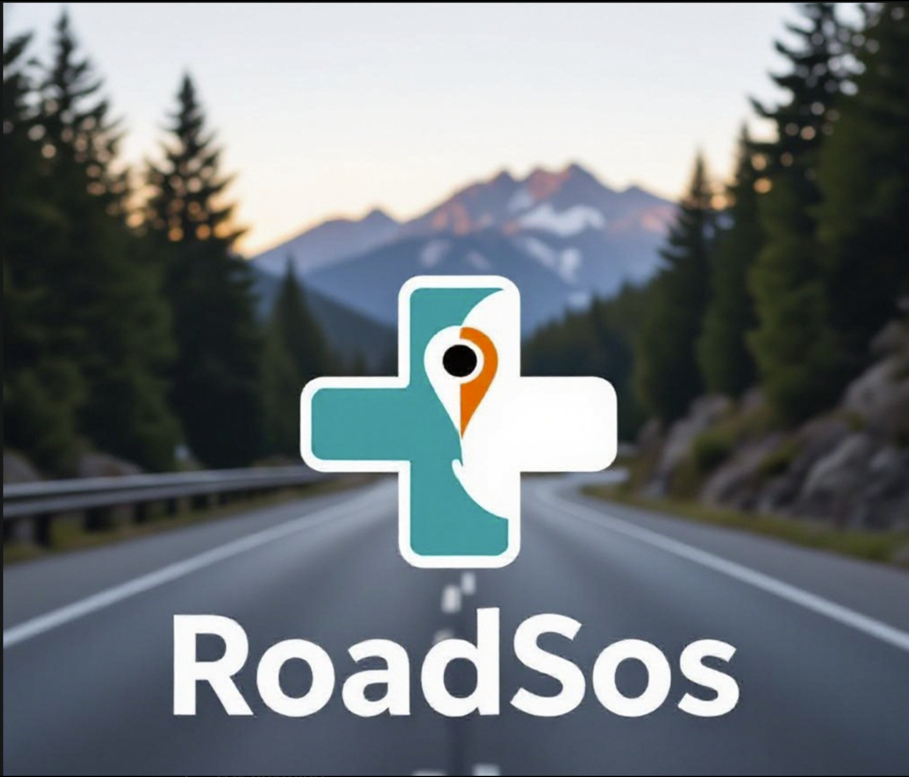

# 🚨 RoadSoS — Intelligent Road Safety & Emergency Assistance

<p align="center">
  
</p>

<h2 align="center">🛣️ RoadSoS</h2>

<p align="center">
  <strong>Smart Road Safety • Emergency Assistance • Faster Response</strong>
</p>

<p align="center">
  A web-based road safety and emergency assistance platform designed to help users access safety-oriented support quickly during road emergencies.
</p>

<p align="center">

  <a href="https://kiran-hub-07.github.io/RoadSoS/">
    🌐 <strong>LIVE DEMO</strong>
  </a>

</p>

---

## 🌐 Live Demo

### 🚀 Experience RoadSoS Online

👉 **https://kiran-hub-07.github.io/RoadSoS/**

The project is deployed using **GitHub Pages**, so you can explore the application directly from your browser without installing anything.

---

# 📌 About the Project

**RoadSoS** is an intelligent road safety and emergency assistance web application created with the goal of making emergency support more accessible and easier to use.

Road emergencies can require immediate action. RoadSoS provides a simple digital interface focused on helping users initiate safety and emergency-related actions with minimal complexity.

The project demonstrates how modern web technologies can be used to create a practical solution for a real-world road safety problem.

---

# 🎯 Problem Statement

Road accidents and roadside emergencies can occur unexpectedly.

During such situations, users may face difficulties such as:

- Finding appropriate assistance quickly
- Communicating an emergency situation
- Accessing important safety-related information
- Taking immediate action under stressful conditions
- Getting help without navigating through complicated interfaces

RoadSoS explores a technology-based approach to make the emergency assistance process simpler and more accessible.

---

# 💡 Proposed Solution

RoadSoS provides a centralized web interface designed around **road safety and emergency assistance**.

The application focuses on:

- 🆘 Emergency assistance
- 📍 Location-oriented support
- 🚨 Safety-focused interaction
- ⚡ Quick access to important actions
- 📱 Responsive web experience
- 🌐 Easy accessibility through a web browser

The project can serve as a foundation for integrating more advanced emergency-response technologies in the future.

---

# ✨ Key Features

## 🆘 Emergency Assistance

RoadSoS provides an emergency-oriented interface that allows users to access safety-related assistance when required.

---

## 📍 Location-Based Assistance

The concept of RoadSoS is centered around helping users communicate and access assistance based on their road/emergency situation.

---

## 🚨 Road Safety Focus

The platform is designed specifically around road safety and emergency scenarios, making the interface focused and easy to understand.

---

## ⚡ Simple & Fast Interaction

Emergency situations require quick actions.

RoadSoS aims to reduce unnecessary navigation and provide users with an easy-to-understand interface.

---

## 📱 Responsive Interface

The web application is designed to work across different screen sizes, including:

- 💻 Desktop
- 💻 Laptop
- 📱 Mobile
- 📲 Tablet

---

## 🌐 Progressive Web App Support

RoadSoS includes Progressive Web App-related components such as:

- `manifest.json`
- `service-worker.js`

This provides a foundation for making the web application behave more like an installable application.

---

# 🧠 How RoadSoS Works

The basic workflow can be represented as:


```text

